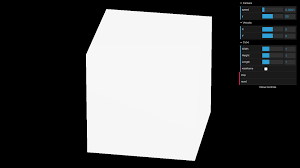

## DRACO AND CMAKE

#### Continuation

[Compressing 3D Model Files with Draco](https://spin.atomicobject.com/2018/09/30/compress-3d-files-draco/)

###### MY REPO in (HOW TO INSTALL DRACO / CMAKE)

[INSTALLING CMAKE](https://github.com/nadiamariduena/nm-final-three-scene)

 <br>
 <hr>

# 🐖

##  OBJ or PLY files

- ONCE YOU ARE DONE With the Draco and Cmake installation

- **Modify the first file** 🍦

> draco_encoder 

- Will read **OBJ or PLY** files as input, and output Draco-encoded files **".drc"**

<br>

- GO TO **BLENDER** and create a geometry (a cube etc) **save it in a .ply format** inside the **draco-test folder**. (draco test is the name i choose while creating it)

<br>

- **Open your terminal** (inside the folder the "draco test folder" is, this is not the respository draco folder you downloaded from github)

<br>

- Here you will **convert a .ply file format to a drc. format**

```javascript
~/Documents/draco-test$ ./draco_encoder -i sphere.ply -o sphere.drc
```

<br>

#### result 🔴

```javascript
Encoder options:
  Compression level = 7
  Positions: Quantization = 11 bits
  Normals: Quantization = 8 bits

Encoded mesh saved to sphere.drc (1 ms to encode).

Encoded size = 2625 bytes

For better compression, increase the compression level up to '-cl 10' .
/// OPTIONS TO CHANGE THE SIZE OF THE FORMAT
// include -cl 10 in between the line
./draco_encoder -i sphere.ply -cl 10 -o sphere_1newcompress.drc


```

#### OPTIONS TO CHANGE THE SIZE OF THE FORMAT

- include -cl 10 in between the line

```javascript
./draco_encoder -i sphere.ply -cl 10 -o sphere_1newcompress.drc
// ./draco_decoder -i in.drc -o out.obj
```

<br>
<br>
<hr>
<br>
<br>


# 🍦 🍦 🍦

## GLTF AND DRACO

_**GLTF AND DRACO**_ Compression

- I ve been trying to use the GLTF Pipeline like I used to before I installed draco and the draco set up.

<br>

- Since then it doesn't seems to work in the way I want, I am going to do it manually by just using the blender draco compression.

<br>

- Here are few tests I did with a 1,2MB file (Model)
  It will serve like a Boilerplate for high res Models until i find the solution with the Pipeline.

```javascript
addCustomSceneObjects = () => {
  //

  //---------------------------
  //
  // ******** test ***** modifiers

  const loader = new GLTFLoader();
  const dracoLoader = new DRACOLoader();
  dracoLoader.setDecoderPath("myDecoder/");
  loader.setDRACOLoader(dracoLoader);
  // //
  // // WITH NO MODIFIERS AND NO TANGENTS = 1.2 MB
  // loader.load("./models/bird_paradiso_noModifiers.glb", (gltf) => {
  //   this.meshy = gltf.scene;

  //   gltf.scene.traverse((model) => {
  //     if (model.material) model.material.metalness = 0.08;

  //     model.receiveShadow = true;
  //     model.scale.set(1.5, 1.5, 1.5);
  //     // model.rotation.y = 1;
  //     // model.rotation.x += -0;
  //     // model.rotation.y += 0;
  //     //
  //     model.position.x = 0;
  //     model.position.y = 5;
  //     model.position.z = 0;
  //   });

  //   this.scene.add(gltf.scene);
  // });
  // //
  // //
  // // TANGENTS  29.4MB
  // loader.load("./models/bird_paradiso_tangents.glb", (gltf) => {
  //   this.meshy = gltf.scene;

  //   gltf.scene.traverse((model) => {
  //     if (model.material) model.material.metalness = 0.08;

  //     model.receiveShadow = true;
  //     model.scale.set(1.5, 1.5, 1.5);
  //     // model.rotation.y = 1;

  //     //
  //     model.position.x = 0;
  //     model.position.y = 0.7;
  //     model.position.z = 0;
  //   });

  //   this.scene.add(gltf.scene);
  // });
  // //
  // // WITH MODIFIERS 20.7MB
  // loader.load("./models/bird_paradiso_withmodifiers.glb", (gltf) => {
  //   this.meshy = gltf.scene;

  //   gltf.scene.traverse((model) => {
  //     if (model.material) model.material.metalness = 0.08;

  //     model.receiveShadow = true;
  //     model.scale.set(1.5, 1.5, 1.5);
  //     // model.rotation.y = 1;

  //     //
  //     model.position.x = -5;
  //     model.position.y = -5;
  //     model.position.z = 0;
  //   });

  //   this.scene.add(gltf.scene);
  // });

  //
  //
  // ---------------------------
  // COMPRESSION
  //without modifiers and tangents  192,3 Kb and WITH compression
  loader.load(
    "./models/bird_paradiso_compressed_without_mod-and-tangent.glb",
    (gltf) => {
      this.meshy = gltf.scene;

      gltf.scene.traverse((model) => {
        if (model.material) model.material.metalness = 0.08;

        model.receiveShadow = true;
        model.scale.set(0.5, 0.5, 0.5);
        // model.rotation.y = 1;

        //
        model.position.x = -2;
        model.position.y = 4;
        model.position.z = 6;
      });

      this.scene.add(gltf.scene);
    }
  );
  //
  //
  //
  // COMPRESSED
  // WITH MODIFIERS and NO tangents = 2.3Mb
  loader.load("./models/bird_compres_modi_notangetnts.glb", (gltf) => {
    this.meshy = gltf.scene;

    gltf.scene.traverse((model) => {
      if (model.material) model.material.metalness = 0.08;

      model.receiveShadow = true;
      model.scale.set(0.5, 0.5, 0.5);
      // model.rotation.y = 1;

      //
      model.position.x = 0;
      model.position.y = 2;
      model.position.z = 6;
    });

    this.scene.add(gltf.scene);
  });
  //
  //
  //

  // Compressed and with Modifiers and Tangents
  // 11.0 MB

  // loader.load(
  //   "./models/bird_paradisocompressed_WithModiAndTangents.glb",
  //   (gltf) => {
  //     this.meshy = gltf.scene;

  //     gltf.scene.traverse((model) => {
  //       if (model.material) model.material.metalness = 0.08;

  //       model.receiveShadow = true;
  //       model.scale.set(0.5, 0.5, 0.5);
  //       // model.rotation.y = 1;

  //       //
  //       model.position.x = 2;
  //       model.position.y = 3;
  //       model.position.z = 6;
  //     });

  //     this.scene.add(gltf.scene);
  //   }
  // );

  // COMPRESSED with draco pipeline (working and not working) still dont know why!!
  /*

nm-draco-obj-compressor/public/models$ gltf-pipeline -i bird_compres_modi_notangetnts.glb -o bird_compres_modi_notangetntsDraco.gltf -d7
Total: 61.186ms

-d7 is how much compression do you want , 7
*/
  // bird_compres_modi_notangetntsDraco.gltf  196.6 Kb

  loader.load(
    "./models/bird_paradisocompressed_WithModiAndTangents.glb",
    (gltf) => {
      this.meshy = gltf.scene;

      gltf.scene.traverse((model) => {
        if (model.material) model.material.metalness = 0.08;

        model.receiveShadow = true;
        model.scale.set(0.5, 0.5, 0.5);
        // model.rotation.y = 1;

        //
        model.position.x = 2;
        model.position.y = 3;
        model.position.z = 6;
      });

      this.scene.add(gltf.scene);
    }
  );

  //---------------------------
  //
  // ******** test ***** modifiers

  // First compress it in Blender
  // Then use the gltf-pipeline to compress it further (at your own risk)
  // Beanstalk-compress.glb is the name of the file i want to compress
  // You have to be in the right directory
  // myProject/public/models$   gltf-pipeline -i Beanstalk-compress.glb -d
  //  result
  // Beanstalk-processed.gltf or glb depending of your file
  //
};
```

 

<br>
<br>
<hr>
<br>
<br>

# 🌵

## AFTER DEFAULT BLENDER COMPRESSION

- I decided to give a last try to the gltf-pipeline compression

#### USING -d7

```javascript
//
 /nm-draco-obj-compressor/public/models$
 gltf-pipeline -i bird_compres_modi_notangetnts.glb -o bird_compres_modi_notangetntsDraco.gltf -d7
//
Total: 61.186ms
```

#### USING -d10

```javascript
/nm-draco-obj-compressor/public/models$ gltf-pipeline -i bird_compres_modi_notangetnts.glb -o bird_compres_modi_notangetntsDraco2.gltf -d10
Total: 41.537ms
```

[]()

<br>
<br>

## 🌵

# AFTER THE PIPELINE TESTS

##### I DECIDED TO MANIPULATE THE SUBDIVISION Modifier to see if there was a possibilty to recude the size, and yes in fact "there was a way"

## what i've learned so far 🐖

<br>

- **NEVER ADD SUBDIVISION as it (makes it smooth by adding more vertices which is bad in our case) to each part of a model** (yes its cool) BUT ITS painful when using it in a scene due to the cpu/gpu, I am still trying to figure that out.

[CPU vs GPU (What's the Difference?) - Computerphile](https://www.youtube.com/watch?v=_cyVDoyI6NE)

<br>
<br>

##### SO JUST APPLY 1 subdivision to the whole model and thats all!

- AlSO VERY IMPORTANT don't change this inside the (circle), if you dont know what you are doing:

[]()

> 6 14 10 12 12 (**Blender Default**)

<br>

#### I DONT KNOW WHAT I AM DOING, but i am curious 💃

- **LOOK AT** the picture above and then read the following:

> 14 is good as if you use less than that, it will be the opposite of smooth, it will look very quadratic, of course it will pass from 658,8kb (14 quantize), to 401,4 kb (5 quantize)

#### result of changing to (5 quantize)

[]()


<br>
<br>
<hr>
<br>
<br>


## GOOD NEWS 🍦 🍦 🍦

#### I FOUND a way to add smooth without using Subdivision, and its " Shade Smooth" inside of the Object

<br>

- So **WHAT IS** THIS **"Shade Smooth"**?
<br>

- Its just a soft way to add smooth **without using a Modifier** which makes our models really high res, smooth is like air.

[]()

#### Result of  **"Shade Smooth"**

- I Dont like the extrem quadratisch of the beak, yes it s 64,1kb WONDERFUL !! but it s ugly 🔴

```javascript
// birdblleu_ohnesubdivision_and_compression_with_shadesmooth.glb
 64,1Kb  // (extrem quadratic)
```

[]()

<br>
<br>

### Smooth Options

#### Smooth Modifier 🍦

> The **Smooth modifier** smooths a mesh by **flattening the angles between adjacent faces in it**, just like the Smooth tool in Edit Mode. It smooths without subdividing the mesh, the number of vertices remains the same.

- This modifier is not limited to smoothing, though. Its control factor can be configured outside the (0.0 to 1.0) range (including negative values), which can result in interesting deformations.

[]()

[docs/Blender: Smooth Modifier](https://docs.blender.org/manual/en/latest/modeling/modifiers/deform/smooth.html)

<br>

### Result 🔴

- The result of the **smooth Modifier** is good, but since its a Modifier it will of course add it to the size of the model, so here we have **192,5 Kb**

```javascript
//birdblleu_smoothModifier_Withcompression_modifer.glb
 192,5Kb  // (a bit quadratic)
```

[]()

<br>

- Its a Bit quadratisch but **its not that bad**, of course **my goal is to have the models as smooth as possible**, but until i find a way to reduce the size of the model, its okay.

- SO what i am going to do, is to add a modifier to the beak/bec and then add a simple **smooth shading** to the rest of the body.

### Here I added smooth Modifier + Smooth Shading to a Join Model

- I said to a "join" Model, because I tried to add a strong smooth to the beak like the Smooth Modifier and then when join to the rest of the body , apply the smooth shading  **It didnt work** as somehow the whole thing get distorted.

- WHEN I SAID "join" i make reference to "MERGE" , take the gerometries  and join them to one.

#### As you can see, its a mess

[]()

#### So this is what worked

- I added a Smooth Modifier ( 1622 FACTOR AND 2 of REPEAT )then i added a smooth shading to the whole "join" model, isn't perfect but can work...

<br>

- And as you can see in the image, it makes a total of **63,9Kb**

[]()

<br>
<br>

- **ANOTHER option would be to add a GUI panel**, with an option to make it smooth on the screen, this can be a choice that will give the user the possibility to add as much as smooth as they want.

<br>
<br>

## More Options 🌵

#### GUI Panel example

- The Gui Panel is the box with the blue bars, that let you manipulate the model.

[]()

#### ANOTHER EXAMPLE

- Here you can see how i can manipulate the vertices of someone else models

##### TRY IT

[](https://threejs.org/examples/?q=subd#webgl_modifier_subdivision)